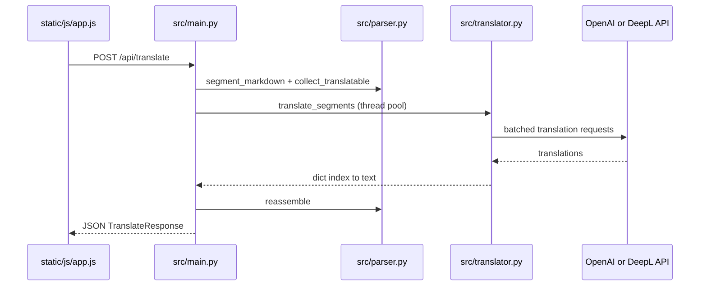

# External Integrations

**Analysis Date:** 2026-05-28

## APIs & External Services

**Translation — OpenAI (default):**
- Purpose: Contextual Markdown translation via chat completions with structured JSON output
- SDK/Client: `openai` package — `OpenAI` client in `src/translator.py` `create_openai_client()`
- Auth: `OPENAI_API_KEY` environment variable
- Endpoint: OpenAI default API, overridable with `OPENAI_BASE_URL` (supports Ollama, Azure OpenAI, other OpenAI-compatible gateways)
- Model: `OPENAI_MODEL` (default `gpt-4o-mini` in `src/translator.py` `_translate_openai_batch`)
- API shape: `client.chat.completions.create` with `response_format={"type": "json_object"}`, system prompt `SYSTEM_PROMPT`, temperature `0.3`
- Resilience: retries on `RateLimitError` and retriable `APIError` status codes 429/500/502/503; batch splitting on malformed JSON responses

**Translation — DeepL (optional):**
- Purpose: Neural translation with `preserve_formatting` for Markdown segments
- SDK/Client: `deepl` package — `deepl.Translator` in `src/translator.py` `create_deepl_client()`
- Auth: `DEEPL_API_KEY`
- Endpoint: `DEEPL_API_URL` optional (README: `https://api-free.deepl.com` for free plan; SDK default if unset)
- Selection: `TRANSLATION_PROVIDER=deepl` in `src/translator.py` `get_provider()`
- Language mapping: internal codes → DeepL API codes via `DEEPL_TARGET_MAP` / `DEEPL_SOURCE_MAP` in `src/translator.py` (subset of `LANGUAGE_NAMES`; regional languages like `ca`, `gl`, `eu` not in DeepL map)
- Context string: `DEEPL_CONTEXT` passed to `translate_text` for documentation-aware translation

**Google Fonts (frontend):**
- Purpose: Plus Jakarta Sans typography
- Integration: `<link>` to `fonts.googleapis.com` / `fonts.gstatic.com` in `static/index.html`
- Auth: none

**Tailwind CSS CDN (frontend):**
- Purpose: Utility-first styling and theme extension in-page
- Integration: `<script src="https://cdn.tailwindcss.com">` and inline `tailwind.config` in `static/index.html`
- Auth: none

## Data Storage

**Databases:**
- None — no ORM, SQL, or document store

**File Storage:**
- Local filesystem only
  - `output/` — temporary translated `.md` files named `{uuid}_{stem}.{target_lang}{suffix}` before `FileResponse` download (`src/main.py` `translate_file`)
  - In-memory ZIP for batch responses (`io.BytesIO` + `zipfile` in `src/main.py` `translate_batch`)
  - User uploads read into memory via FastAPI `UploadFile.read()`; not persisted except batch ZIP stream

**Caching:**
- None — no Redis, disk cache, or HTTP cache headers for translation results

## Authentication & Identity

**Auth Provider:**
- None for the web API — all routes are unauthenticated
- CORS: permissive middleware in `src/main.py` (`allow_origins=["*"]`, all methods/headers)

**API keys (outbound only):**
- OpenAI or DeepL credentials supplied via environment; validated at translation time with `RuntimeError` → HTTP 503 in routes

## Monitoring & Observability

**Error Tracking:**
- None (no Sentry, Datadog, etc.)

**Logs:**
- Python `logging` module
- `logging.basicConfig(level=INFO)` in `src/main.py` `run()`
- `logger.exception` on translation failures in `translate_text`, `translate_file`, `translate_batch`
- Warning logs for rate limits and batch splits in `src/translator.py`

## CI/CD & Deployment

**Hosting:**
- Not defined in repository — intended as local/single-host Python process per README (`http://127.0.0.1:8000`)

**CI Pipeline:**
- Not detected (no `.github/workflows`, GitLab CI, etc.)

## Environment Configuration

**Required env vars (by provider):**

| Variable | Required when | Documented in |
| -------- | ------------- | ------------- |
| `OPENAI_API_KEY` | `TRANSLATION_PROVIDER=openai` (default) | `.env.example`, `README.md`, `src/translator.py` |
| `OPENAI_MODEL` | Optional (has default) | `.env.example`, `README.md` |
| `OPENAI_BASE_URL` | Optional | `.env.example`, `README.md` |
| `DEEPL_API_KEY` | `TRANSLATION_PROVIDER=deepl` | `README.md`, `src/translator.py` |
| `DEEPL_API_URL` | Optional (free tier) | `README.md` |
| `TRANSLATION_PROVIDER` | Optional (default `openai`) | `README.md` only (not in `.env.example`) |
| `HOST` | Optional | `.env.example`, `README.md` |
| `PORT` | Optional | `.env.example`, `README.md` |

**Secrets location:**
- Local `.env` file (gitignored per `.gitignore`)
- Template without secrets: `.env.example`
- Never commit API keys; `output/` also gitignored because translated docs may be sensitive

## Internal API (browser ↔ server)

The SPA in `static/js/app.js` calls same-origin REST endpoints:

| Method | Route | Client function area | Backend |
| ------ | ----- | -------------------- | ------- |
| `GET` | `/api/languages` | `loadLanguages()` | `src/main.py` `list_languages` |
| `POST` | `/api/translate` | JSON body, editor mode | `src/main.py` `translate_text` |
| `POST` | `/api/translate/file` | `FormData` single file | `src/main.py` `translate_file` |
| `POST` | `/api/translate/batch` | `FormData` multi file (max 20) | `src/main.py` `translate_batch` |

Static assets: `app.mount("/static", StaticFiles(...))` in `src/main.py`; root `/` serves `static/index.html`.

Interactive OpenAPI: FastAPI `/docs` (mentioned in `README.md`).

## Webhooks & Callbacks

**Incoming:**
- None

**Outgoing:**
- None — synchronous request/response to translation APIs only; no callbacks or webhooks

## Integration flow (end-to-end)

**Async pattern:** FastAPI `async` routes offload blocking `translate_segments` to `asyncio.run_in_executor` (`src/main.py`) because OpenAI/DeepL SDK calls are synchronous.

## Provider capability gaps

Documented in `README.md` and enforced in code:

- DeepL does not support all UI language codes (e.g. `ca`, `gl`, `eu`, `hi`, `he`, `vi`, `th` absent from `DEEPL_TARGET_MAP` in `src/translator.py`) — use OpenAI for those targets
- OpenAI supports full `LANGUAGE_NAMES` list with auto source detection when `source_lang` is `auto`

## Third-party dependency on network

| Dependency | Network call |
| ---------- | ------------ |
| OpenAI SDK | HTTPS to api.openai.com or `OPENAI_BASE_URL` |
| DeepL SDK | HTTPS to DeepL API (or `DEEPL_API_URL`) |
| Tailwind CDN | Browser loads script at runtime |
| Google Fonts | Browser loads font CSS at runtime |

Offline mode: not supported; translation requires live API connectivity.

---

*Integration audit: 2026-05-28*
